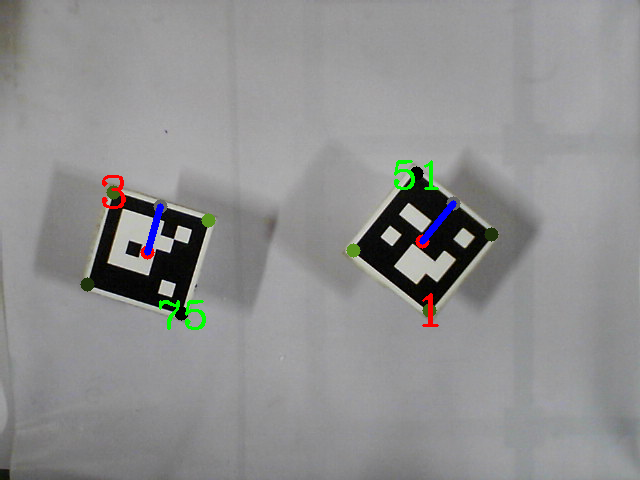
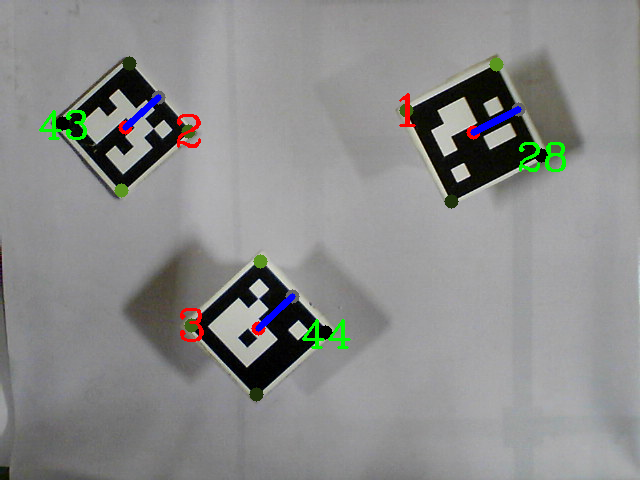

# Aruco-Detection

As part of a competition, I made an aruco marker detection system, the purpose of this was to give values of angles to aruco markers from the horizontal

These are the results:

